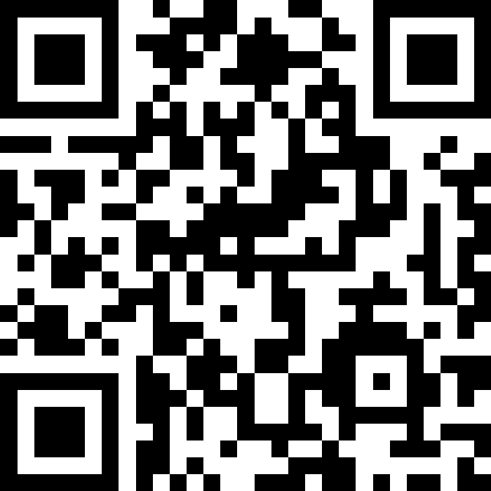

# 中華電信 2026 年上半年 Vibe Coding 課程(每週三10:00~12:00)

## 更新事項

有關本課程的更新事項會在這邊列出。

1、2026/01/07 課程的投影片放在 Slieds/Course01 目錄下，PDF 格式  
2、2026/01/14 課程的投影片放在 Slieds/Course02 目錄下，PPTX 格式  
3、2026/01/21 課程的投影片放在 Slieds/Course03 目錄下，PPTX 格式  
4、2026/01/28 課程的投影片放在 Slieds/Course04 目錄下，PPTX 格式  
5、2026/02/04 課程的投影片放在 Slieds/Course05 目錄下，PPTX 格式

## 注意事項

1. 程式問題提問，請在[Issues](https://github.com/joshhu/cht2026vibecoding/issues)上提問，並且提供程式碼，錯誤訊息，以及問題描述。提問時請使用標準 Markdown 格式

2. 本課程Slido互動平台：(https://app.sli.do/event/tqEjKVsiFjujSJeN22Xkp1)

   

3. 本課程部分內容需要 Google Gemini API Key，金鑰名稱統一使用下列格式：
   - Google Gemini 的API key：`GEMINI_API_KEY`

## 課前準備

1. Google帳號，在Colab/Gemini 上執行程式
2. Google Gemini API Key
3. Cursor 帳號
4. Claude Code 帳號或 Anthropic API Key
5. Github帳號
6. Google AI Pro 帳號

## 課程簡介

由於 Vibe Coding 日新月異，模型每天都有變化，因此本課程會動態調整模型，並且提供相關的程式碼範例。但大方向如下：

1. 大型語言模型的基礎知識
2. Vibe Coding 的基礎知識和使用
3. 利用現有的網頁工具進行 Vibe Coding
4. Cursor 的基礎/進階使用
5. Cursor 開發各種專案
6. Claude Code 的基礎/進階使用
7. Claude Code 開發各種專案

## 上課地點

使用 Microsoft Teams 進行線上上課，請使用 Microsoft Teams 加入課程。

**請在課程開始前 10 分鐘加入。**

## 上課日期

課程時間為早上 10:00~12:00，每次上課時間為 2 小時，中間休息 10 分鐘。

- 2026/01/07
- 2026/01/14
- 2026/01/21
- 2026/01/28
- 2026/02/04
- 2026/02/11
- 2026/02/25
- 2026/03/04
- 2026/03/11
- 2026/03/18
- 2026/03/25
- 2026/04/01

## 教材內容

- `Code`: 課程範例程式
- `Ref`: 課程參考資料
- `Slides`: 課程投影片
